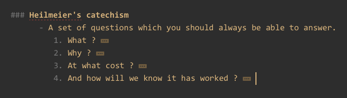
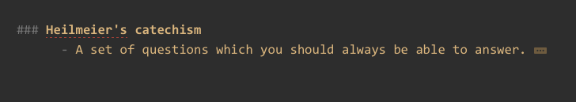

### Collapse whole document more, and Expand whole document more

This plugin creates two keyboard shortcuts:

- Collapse whole document one more level **⌘⌥-**
- Expand whole document one more level	**⌘⌥+**

(Not only hash headings, but also lists and sublists are folded and unfolded)

#### Examples

Whole document (headings and nested lists) collapsed/expanded to:

###### Level 3

###### Level 4
	

###### Level 2

#### Installation in FoldingText 2, or TaskPaper Dev 3

- From the application's main menu, choose `File > Open Application Folder`
- Copy the _Change document expansion level_ `.ftplugin` folder and its contents into the `Plug-Ins` sub-folder of the application folder
	- Copy the folder and contents from [here](https://github.com/RobTrew/tree-tools/tree/master/FoldingText%202%20plugins%20and%20scripts)
	- or extract from the _FoldingText 2 plugins and scripts subfolder_ in [this zip](https://github.com/RobTrew/tree-tools/archive/master.zip)
- Close and restart the application

  Note that you can adjust the keyboard assignment of plugins by editing their _main.js_ file in a text editor, and adjusting the `editor.addKeyMap` section.

  Any modifier keys in the `editor.addKeyMap` section of main.js in the .ftplugin folder must be kept in the following order `Shift-Cmd-Ctrl-Alt-`

